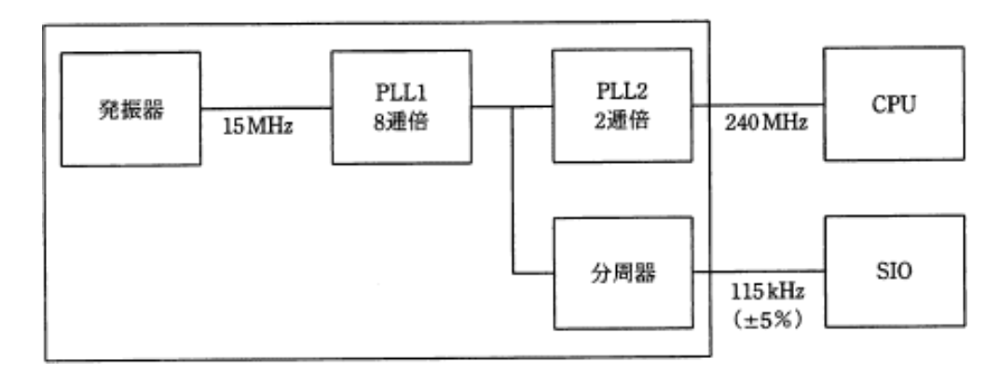

# ブロック図の問題

## 例題（平成30年春期 午前問23）

ワンチップマイコンにおける内部クロック発生器のブロック図を示す．
15MHzの発振器と，内部のPLL1，PLL2及び分周器の組合せでCPUに240MHz，シリアル通信(SIO)に115kHzのクロック信号を供給する場合の分周器の値は幾らか．
ここで，シリアル通信のクロック精度は±5%以内に収まればよいものとする．

- ア. $1/2^4$
- イ. $1/2^6$
- ウ. $1/2^8$
- エ. $1/2^{10}$

## 例題の解答

SIOに供給すべきクロック信号は115kHzであり，これを得るための分周比は以下のように計算される

$$ 120MHz \div 115kHz \fallingdotseq 1043.478 $$

この分周比に最も近い2の累乗は，$2^{10}（＝1024）$である．
さらに，問題文には「クロック精度は±5%以内に収まればよい」とあるため，多少の誤差が許容される．

実際，

$$ 120MHz \div 210 = 117.1875kHz $$

であり，115kHzとの差は約+1.9%，許容範囲内である．
