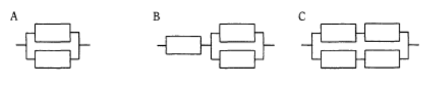

# 稼働率の計算

## 問題例

稼働率の等しい装置を直列や並列に組み合わせた時，システム全体の稼働率を高い順に並べなさい．
ここで，個々の装置の稼働率は0より大きく，1未満である．

## 直列に繋げられた装置の稼働率

稼働率を$R_1$，$R_2$とした場合，以下のようになる．

$$\text{システム全体の稼働率} = R_1 \times R_2 $$

## 並列に繋げられた装置の稼働率

稼働率を$R_1$，$R_2$とした場合，以下のようになる．

$$\text{システム全体の稼働率} = 1 - (1 - R_1) \times (1 - R_2)$$

## 問題例の回答

A,C,B

（解説は割愛）
